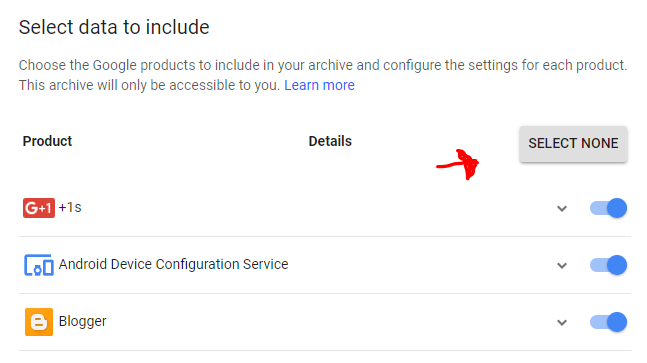
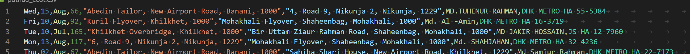

# Pathao Cost Calculator

## How does it work?

Short Answer, by parsing your mails. Pathao sends an invoice for every ride you take. 
This script looks for those mails and extracts out trip details from them.

## Dependencies:
1. Python
2. Mailbox (```pip install mailbox```)
3. GMail Backup

## Steps: 
1. Go to [Download your data](https://takeout.google.com/settings/takeout)
2. SELECT NONE because if you select all it will be huge and may take huge time to archive and download it.

3. Then select only “Mail” 

4. Next >> Create Archive
5. You will get a mail when the archive is complete. Download it

7. Extract the zip archive. You will get a .mbox file. This is the input file
8. Next Run the script ```python pathao_cost_calculator.py /location/to/your/.mbox```
9. Look for ```pathao_cost.csv``` file


The script will then generate a nice csv file that you open with excel to analyze your cost. 

**Note: This scripts relays on Pathao invoice's html design. If they change in the feature the script may not work. But You can tweak the script to work with new invoice!**

**Note: You can also tweak the script to extract any information from your GMail emails !!!**